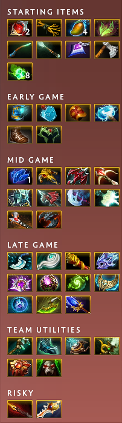

# OpenDotaGuides - 7.38 Wandering Waters

Tired of streamlined, opinionated and slowly updating guides? Want to see many item recommendations from the pros for the newest patch?

Then you're in luck, this project uses what [OpenDota](https://www.opendota.com) has to offer in in their [API](https://docs.opendota.com) and replaces *pretty* outdated and useless default guides in `..<dota_install_path>/game/dota/itembuilds`.

## How to install?

### Running [autoReplace](scripts/autoReplace.py)

You can run this script whenever you like, it'll ask once for your itembuild path.

#### Doing it automatically

Put the script somewhere you like, create a task to run the command  
`python <path-of-your-choosing>/autoReplace.py`  
every day at ~2AM.  
> [!NOTE]
> Run it first to input your itembuild path.

## [Minify](https://github.com/Egezenn/dota2-minify)

You can check the option `OpenDotaGuides Guides` here.

### Manually

1. You can find the Dota2 installation path by going into `Steam` \> `Library` \> right click on `Dota 2` \> `Manage` \> `Browse Local Files`
2. Then go into `game` \> `dota`
3. Replace the `itembuilds` directory's contents with
    1. the contents of [release](https://github.com/Egezenn/OpenDotaGuides/releases/latest)
    2. the contents of your local run. Refer to [here](#local-compilation).
4. Select the default guide in game
5. Have fun!

> [!TIP]
> If you've modified the contents of the folder while you were in Dota and in a match, disconnect & reconnect to see the changes.

## Local compilation

> [!IMPORTANT]
> You need python(~=3.13) and git installed:

First instruction set is for Windows, second is for Linux.

1. `git clone https://github.com/Egezenn/OpenDotaGuides.git`
2. `cd OpenDotaGuides`
3. `python -m venv .venv`
4. Activate the python virtual environment:
   1. `.venv\Scripts\activate.bat`
   2. `source .venv/Scripts/activate`
5. `pip install -r requirements.txt`
6. `python -m odg` `-v -r -c -s` `-h`
7. If the dota installation isn't detected
    1. Remove `itembuilds` folder from Dota2:
        1. `rmdir <dota_install_path>\dota 2 beta\game\dota\itembuilds`
        2. `rm -r <dota_install_path>/dota 2 beta/game/dota/itembuilds`
    2. Move newly created guides:
        1. `move .\itembuilds <dota_install_path>\game\dota\itembuilds`
        2. `mv ./itembuilds <dota_install_path>/game/dota/itembuilds`

## Dependencies

### Binaries

[Python ~=3.11](https://www.python.org/) - Core language. Licensed under PSFL license.

### Python packages

[Python ~=3.11](https://www.python.org/) - Used to interact with OpenDota API. Licensed under Apache-2.0 license.
