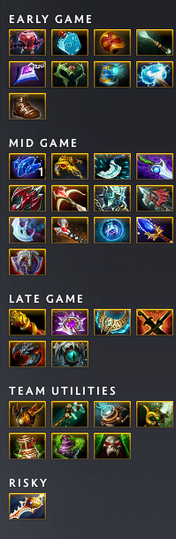

# OpenDotaGuides




Tired of streamlined, opinionated and slowly updating guides? Want to see many item recommendations from the pros for the newest patch?

Then you're in luck, this project uses what [OpenDota](https://www.opendota.com) has to offer in in their [API](https://docs.opendota.com) and replaces *pretty* outdated and useless default guides in `..<dota_install_path>/game/dota/itembuilds`.

## Installation

### Running [autoReplace](scripts/autoReplace.py)

You can run this script whenever you like, it'll ask once for your itembuild path.

#### Doing it automatically

Put the script somewhere you like, create a task to run the command  
`python <path-of-your-choosing>/autoReplace.py`  
every day at ~2AM (UTC).  
> [!NOTE]
> Run it first to input your itembuild path.

## [Minify](https://github.com/Egezenn/dota2-minify)

You can check the option `OpenDotaGuides Guides` here.

### Manually

1. You can find the Dota2 installation path by going into `Steam` \> `Library` \> right click on `Dota 2` \> `Manage` \> `Browse Local Files`
2. Then go into `game` \> `dota`
3. Replace the `itembuilds` directory's contents with
    1. the contents of [release](https://github.com/Egezenn/OpenDotaGuides/releases/latest)
    2. the contents of your local run. Refer to [here](#local-development).
4. Select the default guide in game
5. Have fun!

> [!TIP]
> If you've modified the contents of the folder while you were in Dota and in a match, disconnect & reconnect to see the changes.

## Local development

> [!IMPORTANT]
> You need `python`(~=3.13), `uv` and `git` installed:

1. `git clone https://github.com/Egezenn/OpenDotaGuides.git`
2. `cd OpenDotaGuides`
3. `uv run odg`

## Meaning of the item flags

### Start

Will be assumed to be bought with the starting gold. It'll not be included by default (`-s` flag) because it holds little to no importance.

```plaintext
Blood Grenade
Enchanted Mango
Faerie Fire
Iron Branch
Magic Stick
Quelling Blade
Tango
```

### Consumable

These are consumable items that you are expected to buy irregardless of the hero you're playing but *mostly* not as a starting item. Will not be included.

```plaintext
Clarity
Dust of Appearance
Healing Salve
Infused Raindrops
Observer Ward
Sentry Ward
Smoke of Deceit
Town Portal Scroll
```

### Ignore

Items that appear in the game files even if they aren't used anywhere or can't be bought normally (roshan drops, neutral items). Will not be included.

### Early

These are generally not intended to be bought as a starting item (can mostly be bought with the starting gold), rather as the first small item you're going to be completing. They'll be included into the guides (inserted to the early section if `-s` argument is given, else to the starting section) as they are more likely to be bought more distinctively. For example:

- Tinker buying bottle irregardless of position for faster regen inside the fountain and having a source of regen in the early game.
- Venomancer buying orbs to stack it's innate damage.
- Medusa buying Ring of Basilius for cheap constant mana regen.

```plaintext
Bottle
Bracer
Magic Wand
Null Talisman
Orb of Blight
Orb of Frost
Orb of Venom
Ring of Basilius
Wraith Band
```

### Component

These items (recipes, small stat items) are mostly bought with the intention of building a bigger item, it doesn't hold a value as to what the hero is building, so they won't be included.

### Team

Bought mostly to be used with the team.

```plaintext
Assault Cuirass
Boots of Bearing
Crimson Guard
Drum of Endurance
Force Staff
Glimmer Cape
Guardian Greaves
Holy Locket
Lotus Orb
Mekansm
Pipe of Insight
Solar Crest
Spirit Vessel
Urn of Shadows
Vladmir's Offering
```

### Risky

Items that have drop when the wielder dies / items that appear often as fun purchases.

```plaintext
Gem of True Sight
Hand of Midas
Dagon
Divine Rapier
Meteor Hammer
```

### No flag

Will be included in the first section they appear in the data. These are full items (Shiva's Guard, Linken's Sphere).

## Dependencies

### Binaries

[Python ~=3.11](https://www.python.org) - Core language. Licensed under PSFL license.

### Python packages

[requests](https://github.com/psf/requests) - Used to interact with OpenDota API. Licensed under Apache-2.0 license.
